# github-actions-azure-cicd
CI/CD pipeline using Github Actions to automatically deploy updates to Azure on every push. 

Azure CI/CD Pipeline – Node.js Web App Deployment
Overview

This project demonstrates a complete CI/CD pipeline using GitHub Actions to build and deploy a Node.js application to Microsoft Azure Web App. The workflow reflects a real-world DevOps process including setup, failure, debugging, and successful deployment.

Objectives
Build a CI/CD pipeline using GitHub Actions
Deploy a Node.js application to Azure Web App
Automate build and deployment
Troubleshoot and resolve pipeline errors
Technologies Used
Microsoft Azure (App Service)
GitHub Actions (CI/CD)
Node.js
Git & GitHub

Step 1 – Repository Setup
initial project repository created with application files.

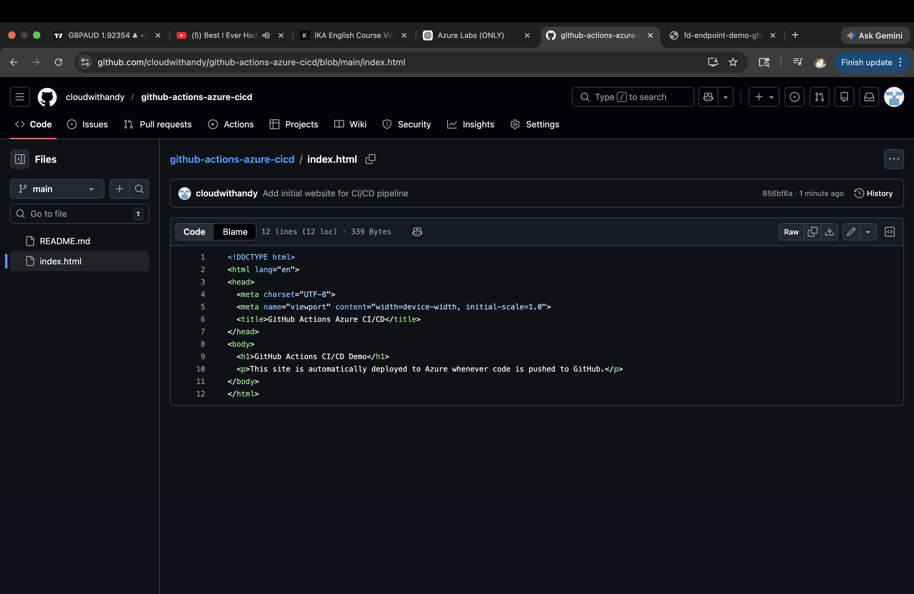

Step 2 - Project structure 
Local development environment with core files (server.js, package.json, workflow files).

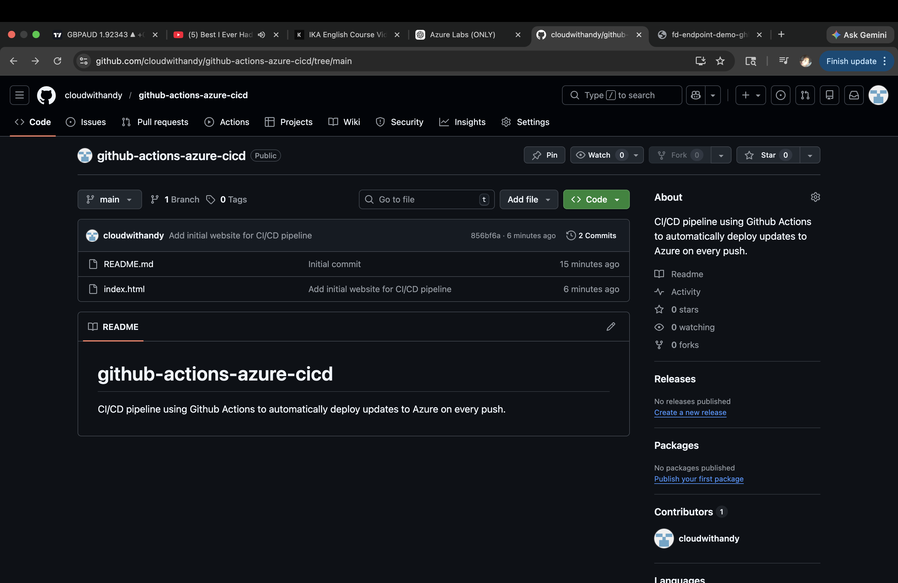

Step 3 - Initial commit 
Project pushed to Github to trigger pipeline

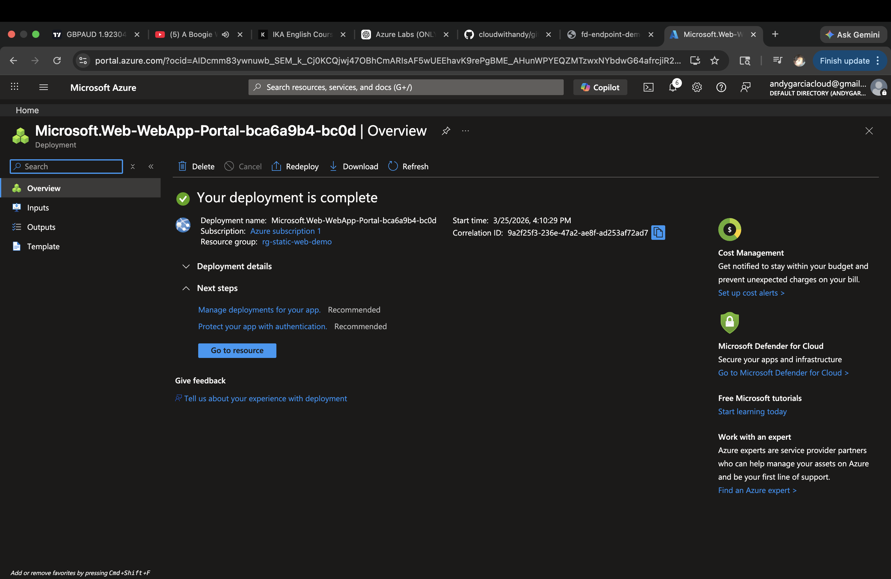

Step 4 - Repository Files 
Verification of repository contents on Github.

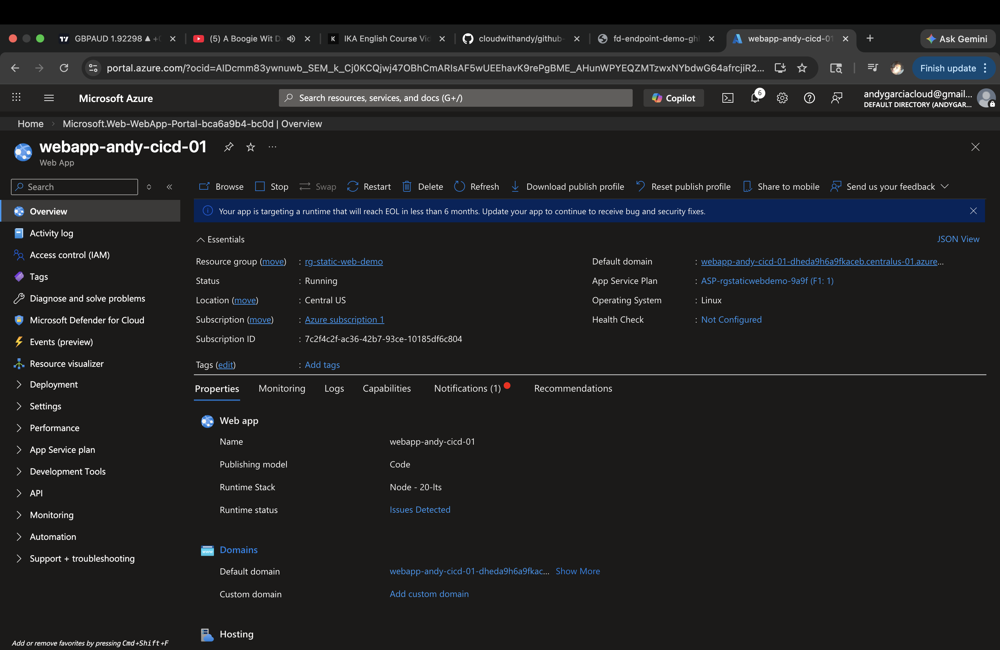

Step 5 - CI/CD Pipeline Setup
Github Actions workflow configured for build and deployment.

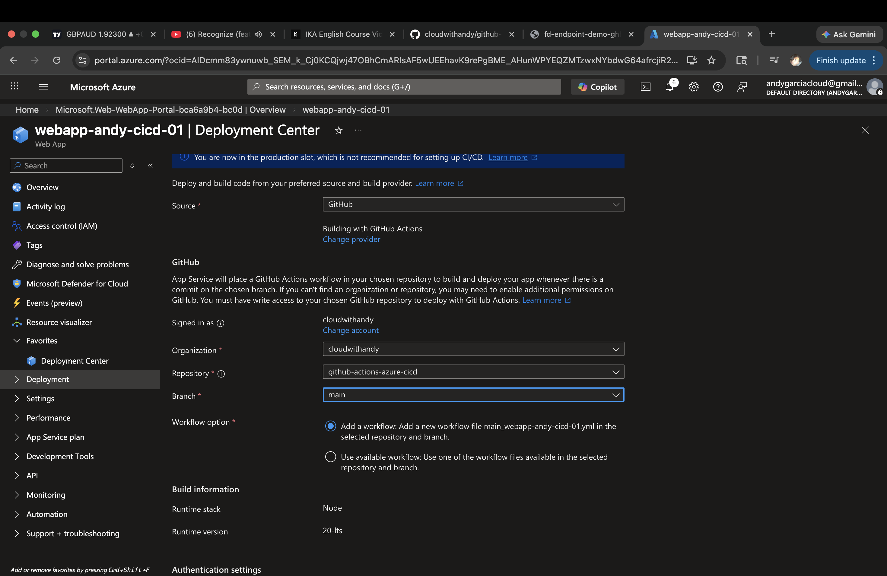

Step 6 - Pipeline Execution (Running)
Pipeline triggered automatically after commit

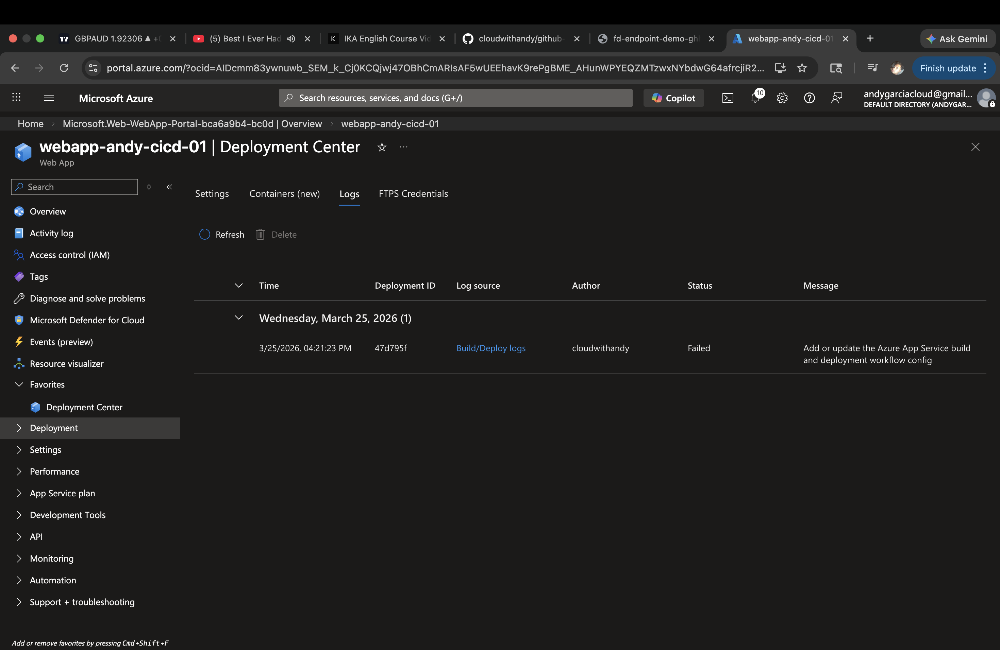

Step 7 - Pipeline Failure
Initial pipeline execution failed due to configuration issues.

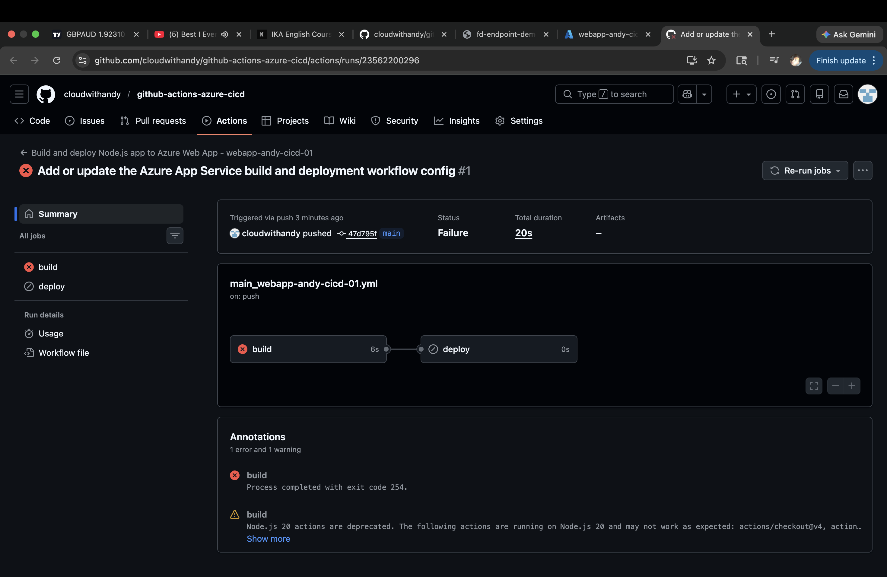

Step 8 - Debuuging the issue 
Logs reviewed to identify JSON parsing error in package.json

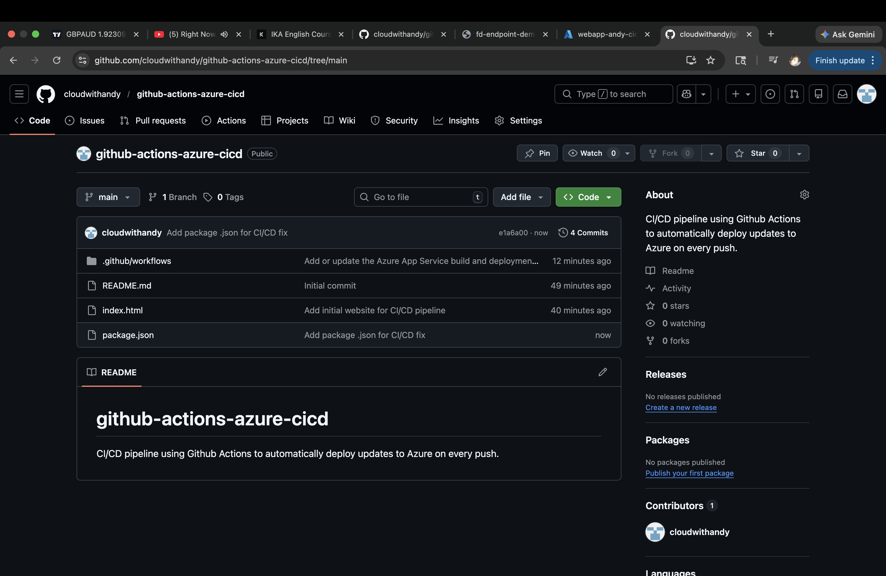

Step 9 - Fix Applied
Configuration corrected to resolve pipeline error

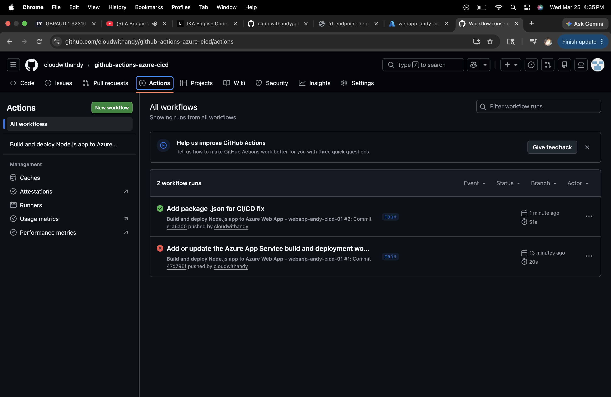

Step 10 - Re-run Pipeline
Pipeline re triggrered after applying fixes.

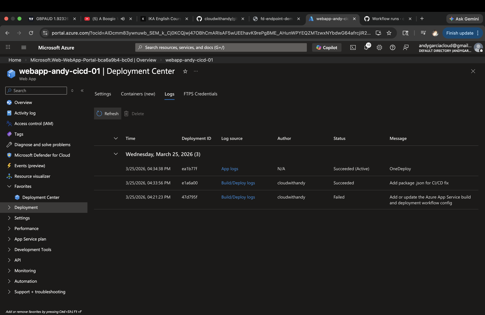

Step 11 - Pipeline Progress 
Pipeline executing successsfully through build stages.

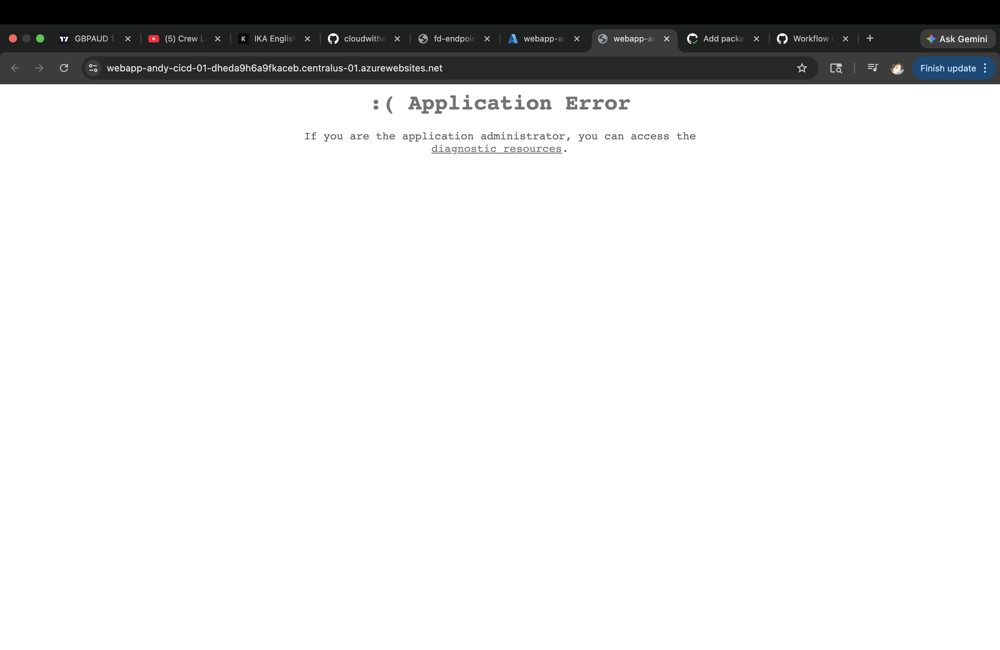

Step 12 - Successsful Build 
Pipeline completed successfully with all steps passing.

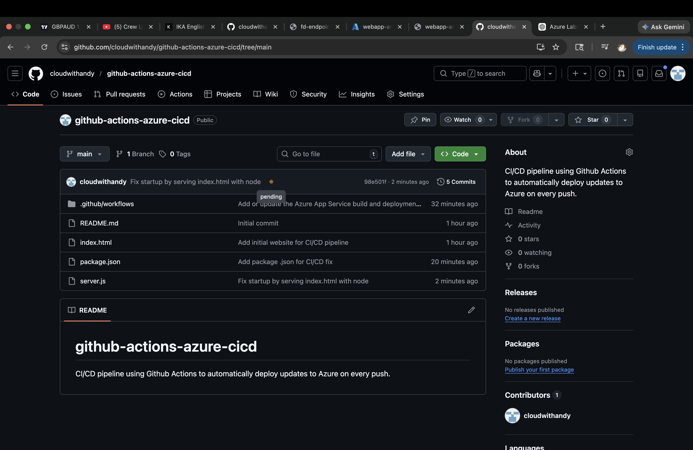

Step 13 - workflow Details 
Detailed view showing all jobs completed successfully

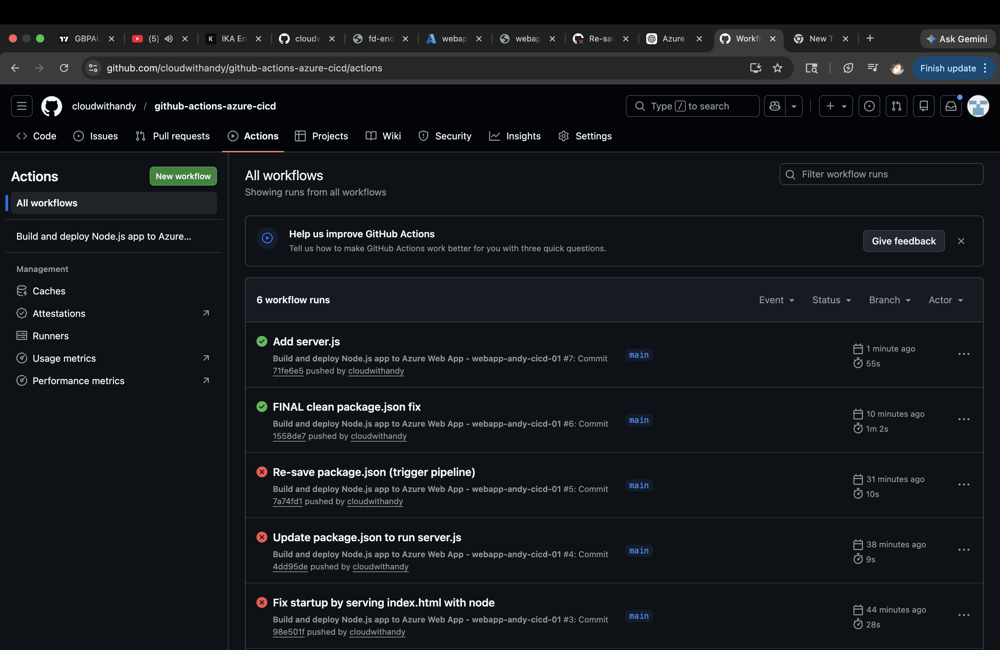

Step 14 - Azure Deployment 
Application deployed to the Azure web app and running 

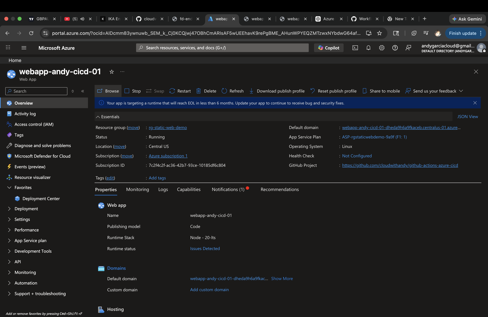

Step 15 - Live Application 
Final validation showing the application running in the browser.

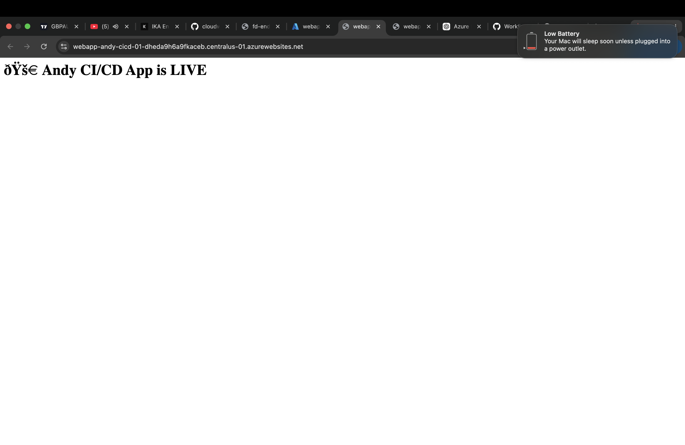

Key Achievements - 
 Implemented a full CI/CD pipeline using Github Actions.
 Automated deployments to Azure Web App
 Diagnosed and resolved pipeline failures 
 Successfully deployed and verified a live cloud hosted application

 Conclusion 
 This project demonstrates hands-on experience with CI/CD, Cloud deployment, and troubleshooting. It reflects the ability to take an application from the initial setup through debugging to a fully deployed production-ready state
